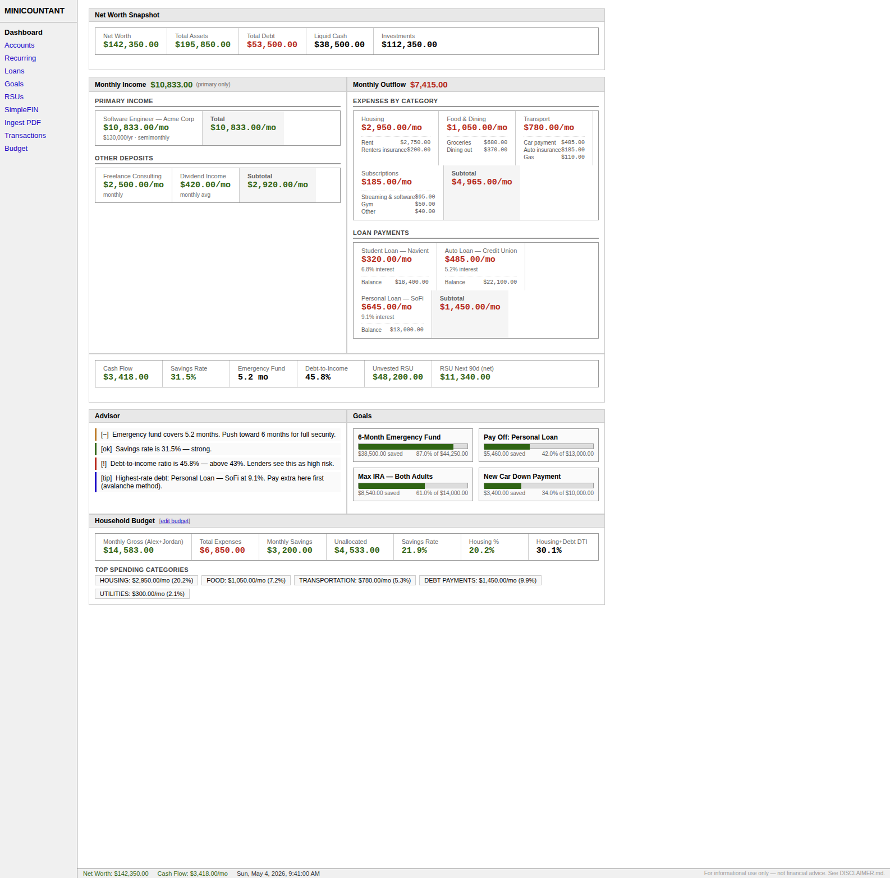

# Minicountant

A self-hosted personal finance dashboard. All data stays on your machine — no cloud accounts, no subscriptions, no telemetry.

> **⚠ Disclaimer:** This software is for informational and organizational purposes only. It is **not** financial, investment, legal, or tax advice. The contributors are not liable for any financial losses or decisions made based on this software. See [DISCLAIMER.md](DISCLAIMER.md) for the full disclaimer. Consult a licensed financial professional before making financial decisions.



## Features

- **Dashboard** — net worth snapshot, monthly income vs. outflow, cash flow, savings rate, emergency fund coverage, debt-to-income ratio, goals progress, and advisor recommendations
- **Household Budget** — Bogleheads-style two-adult budget calculator with category guidelines (housing ≤28%, transport ≤15%, savings ≥20%), Bogleheads investment priority checklist, auto-save to backend, and a live summary card on the dashboard
- **Accounts** — track checking, savings, investment, and other accounts
- **Recurring Income & Expenses** — model your monthly cash flow; auto-detect recurring patterns from imported transactions
- **Loans** — amortization schedules, interest remaining, and a debt payoff calculator (avalanche / snowball) that models paying off debt with RSU proceeds
- **Goals** — savings goals with progress bars and template suggestions (emergency fund, FIRE number, individual loan payoffs)
- **RSU Grants** — vesting schedule tracking, upcoming vest calendar, live price quotes via Alpha Vantage, after-tax value estimates
- **PDF & CSV Ingest** — drop in a bank statement, credit card statement, brokerage statement, or equity awards CSV to auto-import accounts and transactions
- **SimpleFIN** — connect your bank via [SimpleFIN Bridge](https://www.simplefin.org/) for automatic balance and transaction sync
- **Transactions** — searchable, filterable transaction history

## Tech Stack

| Layer    | Technology |
|----------|-----------|
| Backend  | Python · FastAPI · SQLite |
| Frontend | Vanilla JS · HTML · CSS (no frameworks, no build step) |
| Storage  | Single SQLite file at `~/.wealth/wealth.db` |

## Getting Started

### Option 1 — Download a pre-built binary (recommended)

Go to the [Releases page](https://github.com/aneangel/minicountant/releases) and download the binary for your platform:

| Platform | File |
|---|---|
| macOS — Apple Silicon (M1/M2/M3/M4) | `Minicountant-macos-arm64.dmg` |
| macOS — Intel | `Minicountant-macos-x86_64.dmg` |
| Linux — x86_64 | `minicountant-linux-x86_64` |
| Linux — ARM64 | `minicountant-linux-arm64` |
| Windows | `minicountant-windows-x86_64.exe` |

**macOS:** Open the DMG, drag `Minicountant.app` to your Applications folder, then double-click it. If macOS blocks it on first launch (Gatekeeper), right-click the app → Open.

**Linux:** Requires WebKit2GTK (the system browser engine — most desktop Linux installs already have it):
```bash
# Ubuntu / Debian
sudo apt install python3-gi gir1.2-webkit2-4.0

# Fedora
sudo dnf install python3-gobject webkit2gtk4.0

# Arch
sudo pacman -S python-gobject webkit2gtk
```
Then run the binary:
```bash
chmod +x minicountant-linux-x86_64
./minicountant-linux-x86_64
```

**Windows:** Double-click `minicountant-windows-x86_64.exe`. Requires Edge WebView2, which is pre-installed on Windows 10 (1803+) and Windows 11.

---

### Option 2 — Run from source

**Requirements:** Python 3.10+

```bash
# 1. Clone
git clone https://github.com/aneangel/minicountant.git
cd minicountant

# 2. Create and activate a virtual environment
python3 -m venv .venv
source .venv/bin/activate        # Windows: .venv\Scripts\activate

# 3. Install dependencies
pip install -r requirements.txt

# 4a. Launch as a desktop app (no browser needed)
python desktop.py

# 4b. Or run as a local web server and open in your browser
./run.sh                         # then open http://localhost:8765
```

The SQLite database is created automatically at `~/.wealth/wealth.db` on first run. No migrations or setup scripts needed.

## Configuration

All configuration is stored in the database `config` table — no config files or environment variables required for basic use.

### Optional: Live RSU price quotes

To enable live stock price fetching (used by the RSU page), get a free API key from [Alpha Vantage](https://www.alphavantage.co/support/#api-key) and add it through the RSU page UI, or set it directly:

```bash
sqlite3 ~/.wealth/wealth.db "INSERT OR REPLACE INTO config(key,value) VALUES('alphavantage_key','YOUR_KEY_HERE');"
```

### Optional: SimpleFIN bank connection

[SimpleFIN Bridge](https://www.simplefin.org/) lets you pull real bank balances and transactions. Sign up, generate a setup token, and paste it on the SimpleFIN page in the app.

## Project Structure

```
minicountant/
├── desktop.py               # Desktop app entry point (pywebview + uvicorn)
├── main.py                  # FastAPI app
├── database.py              # SQLite schema + migrations
├── run.sh                   # Dev web-server launcher (browser-based)
├── build.sh                 # Local desktop build script
├── minicountant.spec        # PyInstaller build spec
├── requirements.txt         # Runtime dependencies
├── requirements-build.txt   # Build-only dependencies (PyInstaller)
├── .github/workflows/
│   └── build.yml            # CI: builds binaries for all platforms on tag push
├── routers/
│   ├── accounts.py          # Account CRUD
│   ├── budget.py            # Budget persistence (save/load)
│   ├── dashboard.py         # Aggregated dashboard metrics
│   ├── goals.py             # Goal CRUD + templates
│   ├── ingest.py            # PDF/CSV parsing and import
│   ├── loans.py             # Loan CRUD + amortization
│   ├── recurring.py         # Recurring income/expense CRUD
│   ├── rsus.py              # RSU grant CRUD + equity summary
│   ├── simplefin.py         # SimpleFIN bank sync
│   └── transactions.py      # Transaction search + edit
├── static/
│   ├── app.js               # All frontend logic (single file, no build step)
│   └── style.css
└── templates/
    └── index.html           # Single-page app shell
```

## Building from Source

To produce a native binary on your own machine:

```bash
./build.sh
```

Output lands in `dist/`. On macOS this produces `Minicountant.app`; on Linux and Windows it produces a single executable named `minicountant`.

To produce release binaries for all platforms, push a version tag and GitHub Actions handles the rest:

```bash
git tag v1.2.0
git push origin v1.2.0
```

## Data & Privacy

- **Everything is local.** The SQLite database lives at `~/.wealth/wealth.db` on your machine.
- The only outbound network calls are:
  - Alpha Vantage (stock quotes) — only when you click "Refresh Price" or configure a key
  - SimpleFIN Bridge — only when you explicitly connect and sync
- No analytics, no tracking, no third-party scripts.

## Recurring Income Categories

The dashboard separates income into **primary** (marked `category = "primary"` in the recurring table) and supplemental. When you add a recurring income item, set its category to `primary` to have it drive the main cash-flow and savings-rate metrics.

## Contributing

See [CONTRIBUTING.md](CONTRIBUTING.md).

## License

MIT — see [LICENSE](LICENSE).
